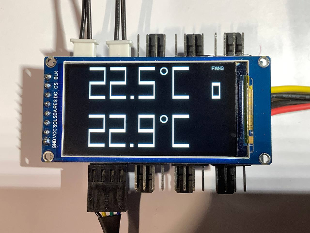
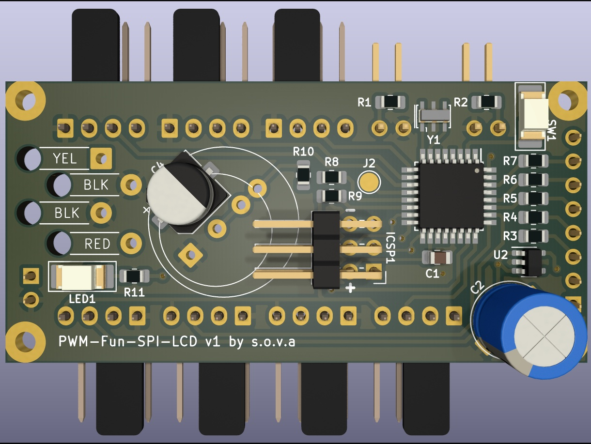

# PWM-Fun
PWM fan controller for water cooled PC

I didn't find the fan controller cheap and cute, so I made it myself.

For building minimal LCD version of this project you need:
* PCB (use Kicad to export gerber files for manufacturing)
* 170x320 SPI LCD (they are cheap and slow)
* ATMega328 microcontroller
* 2.54mm single row 8 pin male + female connector (I recommend short L7.5 version)
* 2x SMD 10k resistor (R1, R2)
* 7x SMD 220 Ohm resistor (R3 - R9)
* SMD 100 nF capacitor (C1)
* SMD(or not) 4.7 uF capacitor (C2)
* 7x angled PC Fan connector  
* M2.5 screws and nuts for mounting.
* SATA to Molex adapter (Not Molex to SATA!)

Equipment:
* Any AVR programmer (You can use any usb arduino board with sketch ArduinoISP, don't forget to press "Upload Using Programmer")
* Good soldering iron recomended.

You can add buzzer and 500 Ohm resistor if you like.

You can add WS2812 strip if you like.

You can use the ATmega internal oscillator if you are not using the WS2812.

Don't forget to short J1 if you not use U2 (probably you don't need U2)

The fans speed is controlled by the thermal sensor 1. The thermal sensor 2 is set to 50°C alarm. I use it to control the temperature of 12VHPWR connector 🩹
